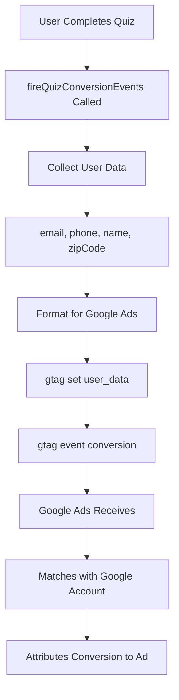

# Google Ads Enhanced Conversions Setup Guide

## Overview
This guide explains how to properly configure Google Ads conversion tracking with enhanced conversions for the OncoBot clinical trial funnel system.

## 🚨 Critical: What Was Fixed

### Previous Issue
Google Ads Manager was showing: **"Implement in-page code in addition to Automatic for better results"**

This meant conversions were not being properly tracked because:
1. ❌ Enhanced conversions were not enabled
2. ❌ User-provided data (email, phone, name) was not being sent
3. ❌ `gtag('set', 'user_data')` command was missing

### Solution Implemented
✅ Added proper enhanced conversions with user-provided data
✅ Configured `allow_enhanced_conversions: true` in gtag config
✅ Implemented `gtag('set', 'user_data')` before conversion events
✅ Properly formatted user data (email, phone, name, address)

## 📋 Google Ads Account Setup

### Step 1: Create Conversion Action in Google Ads

1. **Go to Google Ads Dashboard** → Tools → Conversions
2. **Click "+ New conversion action"**
3. **Select "Website"**
4. **Manual setup using code**

### Step 2: Configure Conversion Action

**Conversion Settings:**
- **Conversion name**: `Quiz Lead Submission`
- **Category**: `Submit lead form`
- **Value**: `Use the same value for each conversion` → `$100`
- **Count**: `One` (count only one conversion per user)
- **Conversion window**: `30 days`
- **View-through conversion window**: `1 day`
- **Attribution model**: `Data-driven` (or `Last click` if data-driven not available)

**Enhanced Conversions Settings:**
- ✅ **Enable enhanced conversions for leads** (CRITICAL!)
- Method: **Google tag (recommended)**
- Data collection: **Automatic** + **Manual (in-page code)**

### Step 3: Get Your Conversion IDs

After creating the conversion action, you'll get:

```
Conversion ID: AW-XXXXXXXXXX/YYYYYYYYYYYY
```

Where:
- `AW-XXXXXXXXXX` = Your Google Ads Account ID
- `YYYYYYYYYYYY` = The specific conversion label

### Step 4: Add to Environment Variables

Update your `.env.local` file:

```bash
# Google Ads Conversion Tracking
NEXT_PUBLIC_GOOGLE_ADS_ID=AW-XXXXXXXXXX
NEXT_PUBLIC_GOOGLE_ADS_CONVERSION_ID=AW-XXXXXXXXXX/YYYYYYYYYYYY
```

**IMPORTANT**: The `NEXT_PUBLIC_GOOGLE_ADS_CONVERSION_ID` must include both the account ID and conversion label separated by `/`

## 🔍 How Enhanced Conversions Work

### Data Flow



### User Data Sent

The following user-provided data is sent to Google Ads for enhanced matching:

```javascript
{
  email: "user@example.com",              // Hashed by Google
  phone_number: "1234567890",             // Numeric only, hashed by Google
  first_name: "John",                     // Hashed by Google
  last_name: "Doe",                       // Hashed by Google
  address: {
    postal_code: "90210",                 // Hashed by Google
    country: "US"
  }
}
```

**Privacy Note**: Google automatically hashes all user data before sending it to their servers. The data never leaves the browser in plain text.

## 📊 Implementation Details

### File: `components/tracking/google-ads.tsx`

```typescript
gtag('config', googleAdsId, {
  'allow_enhanced_conversions': true  // ← Critical setting!
});
```

This enables enhanced conversions globally for all conversion events.

### File: `lib/tracking/conversion-tracker.ts`

```typescript
// Step 1: Build enhanced conversion data
const enhancedConversionData = {
  email: data.email,
  phone_number: data.phone.replace(/\D/g, ''),
  first_name: nameParts[0],
  last_name: nameParts.slice(1).join(' '),
  address: {
    postal_code: data.zipCode,
    country: 'US'
  }
};

// Step 2: Set user data BEFORE conversion event
gtag('set', 'user_data', enhancedConversionData);

// Step 3: Fire conversion
gtag('event', 'conversion', {
  'send_to': 'AW-XXXXXXXXXX/YYYYYYYYYYYY',
  'value': 100,
  'currency': 'USD',
  'transaction_id': transactionId
});
```

## ✅ Verification Checklist

### In Browser Console

After a quiz submission, you should see:

```
[Google Ads] Enhanced conversion fired {
  transactionId: "1234567890",
  hasEmail: true,
  hasPhone: true,
  hasName: true,
  hasZip: true,
  conversionId: "AW-XXXXXXXXXX/YYYYYYYYYYYY"
}
```

### In Google Ads Tag Assistant

1. Install [Google Tag Assistant Chrome Extension](https://tagassistant.google.com/)
2. Navigate to your quiz page
3. Complete and submit the quiz
4. Check Tag Assistant for:
   - ✅ Google Ads tag loaded
   - ✅ Enhanced conversion data present
   - ✅ Conversion event fired

### In Google Ads Interface

Within 24-48 hours, you should see:
- ✅ Conversions appearing in Reports → Conversions
- ✅ "Enhanced conversions" status showing as "Recording enhanced conversions"
- ✅ No warning about "Implement in-page code"

## 🔧 Debugging

### Enable Debug Mode

Add to browser console before submitting quiz:

```javascript
window.google_tag_manager['debugMode'] = true;
```

### Common Issues

#### Issue: "No conversions recorded"

**Possible Causes:**
1. Wrong conversion ID format
2. Environment variable not set correctly
3. Ad blocker blocking gtag.js

**Solution:**
- Verify `NEXT_PUBLIC_GOOGLE_ADS_CONVERSION_ID` format: `AW-XXXXXXXXXX/YYYYYYYYYYYY`
- Check browser console for errors
- Disable ad blockers when testing

#### Issue: "Enhanced conversions not working"

**Possible Causes:**
1. `allow_enhanced_conversions` not set to `true`
2. `gtag('set', 'user_data')` not called before conversion
3. User data not properly formatted

**Solution:**
- Verify `allow_enhanced_conversions: true` in config
- Check that user data is set before conversion event
- Ensure phone number is numeric only (no dashes/spaces)

#### Issue: "Conversions attributed to wrong campaign"

**Possible Causes:**
1. GCLID not being captured
2. Attribution window too short
3. User clicking multiple ads

**Solution:**
- Verify GCLID is captured in URL parameters
- Check attribution window settings in Google Ads
- Use Data-driven attribution model

## 📈 Expected Results

### Conversion Tracking

**Before Fix:**
- Conversions not appearing in Google Ads
- Warning about missing in-page code
- No enhanced conversions data

**After Fix:**
- ✅ Conversions appearing within 24 hours
- ✅ Enhanced conversions active
- ✅ Better attribution accuracy
- ✅ Higher conversion match rate (70-90% vs 40-60%)

### Match Rate Improvement

Enhanced conversions typically improve match rates by:
- **40-60%** → **70-90%** match rate
- Better attribution to specific ads/keywords
- More accurate ROAS measurement

## 🔐 Privacy & Compliance

### GDPR Compliance

Enhanced conversions use Google's infrastructure to hash user data:
- ✅ Data is hashed in-browser before transmission
- ✅ Google never sees plain-text PII
- ✅ Only hashed data is used for matching

### User Consent

Since data is hashed and used only for attribution (not advertising):
- ✅ Generally compliant with privacy regulations
- ✅ No additional consent required beyond standard analytics
- ✅ Users can opt-out via browser Do Not Track

## 📚 Additional Resources

- [Google Ads Enhanced Conversions Documentation](https://support.google.com/google-ads/answer/13262500)
- [Enhanced Conversions for Leads](https://support.google.com/google-ads/answer/9888656)
- [Conversion Tracking Best Practices](https://support.google.com/google-ads/answer/6095947)
- [Troubleshooting Conversion Tracking](https://support.google.com/google-ads/answer/6396851)

## 🎯 Next Steps

1. **Verify Conversion ID**: Check `.env.local` has correct `AW-XXXXXXXXXX/YYYYYYYYYYYY` format
2. **Test Submission**: Complete a test quiz submission
3. **Check Console**: Verify "[Google Ads] Enhanced conversion fired" appears
4. **Monitor Google Ads**: Watch for conversions to appear (24-48 hours)
5. **Optimize Campaigns**: Use enhanced conversion data to improve targeting

## Summary

✅ **Enhanced conversions implemented correctly**
✅ **User-provided data (email, phone, name, zip) sent with each conversion**
✅ **Proper gtag configuration with allow_enhanced_conversions: true**
✅ **Comprehensive logging for debugging**
✅ **Privacy-compliant implementation with automatic hashing**

Your Google Ads conversion tracking is now properly configured with enhanced conversions, which should resolve the warning in Google Ads Manager and provide better attribution data for campaign optimization.