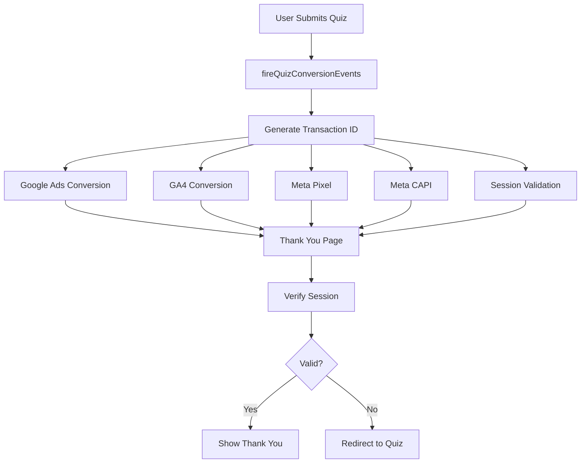

# Analytics & Measurement Architecture

## Overview

This document describes our **coordinated but separate** analytics architecture for the clinical trials funnel system. Following CLAUDE.md principles, we maintain explicit, context-aware tracking across multiple platforms while preserving each platform's unique capabilities.

## 🎯 Core Philosophy: Coordinated but Separate

**Why this approach?**
1. **Full Platform Capabilities**: Each platform can use its specific features (GA4 enhanced ecommerce, Meta advanced matching, etc.)
2. **Explicit & Debuggable**: Clear, explicit code that's easy to troubleshoot
3. **Platform-Optimized**: Each integration is optimized for its specific platform
4. **Context-Aware**: Following CLAUDE.md - understand what each piece does and why

## 📊 Analytics Stack

### Active Platforms

| Platform | Purpose | Implementation | Status |
|----------|---------|----------------|---------|
| **Plausible** | Privacy-first page analytics | Script tag | ✅ Active |
| **Google Analytics 4** | Detailed user behavior & funnels | @next/third-parties | ✅ Active |
| **Google Ads** | Conversion tracking for ads | Direct gtag | ✅ Active (needs label) |
| **Meta Pixel** | Client-side conversion tracking | Custom component | ✅ Active |
| **Meta CAPI** | Server-side conversion tracking | API endpoint | ✅ Active |

### Removed/Deprecated
- **Unified Analytics Hook**: Attempted to abstract all platforms - removed for clarity
- **PostHog**: Not currently active
- **Vercel Analytics**: Not currently active

## 🔄 Conversion Flow Architecture

### The Journey: Quiz Submission → Conversion Events



### Key Components

#### 1. **Conversion Orchestrator** (`/lib/tracking/conversion-tracker.ts`)

Central orchestration point that fires all conversion events in a coordinated manner:

```typescript
export async function fireQuizConversionEvents(data: ConversionData) {
  const transactionId = Date.now().toString(); // Deduplication across platforms

  // 1. Google Ads - Direct gtag for maximum control
  // 2. GA4 - Enhanced conversion with full parameters
  // 3. Meta Pixel - Client-side standard events
  // 4. Meta CAPI - Server-side for reliability
  // 5. Session validation - Prevent false conversions
}
```

**Why centralized orchestration?**
- Single transaction ID for cross-platform deduplication
- Consistent conversion value ($100 per lead)
- Fires all events before navigation (ensures delivery)
- Single place to update conversion logic

#### 2. **Platform-Specific Implementations**

Each platform maintains its own implementation for full feature access:

##### Google Ads (`/components/tracking/google-ads.tsx`)
- Direct gtag implementation
- Awaiting conversion label from new conversion action
- Smart Goals compatible

##### GA4 (`/components/analytics/google-analytics-provider.tsx`)
- Uses @next/third-parties for optimized loading
- Enhanced conversion tracking with hashed PII support
- UTM parameter persistence across session

##### Meta Pixel (`/components/tracking/meta-pixel.tsx`)
- Standard events (Lead, CompleteRegistration)
- Client-side tracking
- Full event parameter support

##### Meta CAPI (`/lib/tracking/meta-capi.ts`)
- Server-side reliability
- SHA-256 hashed PII
- Direct API integration (no AWS needed)

#### 3. **Session Validation**

Prevents false conversions from direct navigation to thank you page:

```typescript
// On quiz submission
sessionStorage.setItem('quiz_completed', {
  timestamp: Date.now(),
  indication: data.indication,
  hasConversionFired: true
});

// On thank you page
const isValid = verifyQuizCompletion(); // Checks timestamp < 1 hour
```

## 📐 Data Flow Patterns

### Page View Tracking
```
User navigates → GA4 Provider → sendGAEvent('page_view') → Analytics
              → Plausible (automatic) → Analytics
```

### Conversion Tracking
```
Quiz Submit → fireQuizConversionEvents() → Google Ads (gtag)
                                        → GA4 (trackConversion)
                                        → Meta Pixel (trackStandardEvent)
                                        → Meta CAPI (/api/track)
                                        → Session Storage
```

### UTM Parameter Handling
```
Landing Page → GA4 Provider → Extract UTMs → sessionStorage
                           → Attach to all events
```

## 🔧 Configuration

### Environment Variables

```env
# Google
NEXT_PUBLIC_GOOGLE_ANALYTICS_ID=G-CMPRL78LQD
NEXT_PUBLIC_GOOGLE_ADS_ID=AW-17578966440
NEXT_PUBLIC_GOOGLE_ADS_CONVERSION_ID=AW-17578966440/[LABEL_NEEDED]

# Meta
NEXT_PUBLIC_FACEBOOK_PIXEL_ID=2227534211079876
META_CONVERSIONS_API_ACCESS_TOKEN=[TOKEN]

# Plausible
NEXT_PUBLIC_PLAUSIBLE_DOMAIN=trials.onco.bot
```

### Conversion Values

Standardized across all platforms:
- **Lead Generation**: $100
- **Trial View**: $10
- **Trial Contact View**: $50
- **Trial Contact Click**: $100

## 🚀 Implementation Guidelines

### Adding New Tracking

1. **Identify the tracking need** - What specific data do you need?
2. **Choose the right platform** - Which platform best serves this need?
3. **Implement platform-specifically** - Use that platform's best practices
4. **Coordinate if needed** - Add to conversion orchestrator if it's a conversion
5. **Document the addition** - Update this file

### Example: Adding a new conversion event

```typescript
// In conversion-tracker.ts
export async function fireNewConversionEvent(data: NewConversionData) {
  const transactionId = Date.now().toString();

  // Add platform-specific calls
  // Maintain consistency with value and deduplication
}
```

### Do's and Don'ts

**DO:**
- ✅ Use platform-specific features (GA4 enhanced ecommerce, Meta advanced matching)
- ✅ Keep implementations explicit and debuggable
- ✅ Coordinate conversions through the orchestrator
- ✅ Use consistent transaction IDs for deduplication
- ✅ Test each platform independently

**DON'T:**
- ❌ Over-abstract platform differences
- ❌ Hide important platform-specific parameters
- ❌ Mix conversion logic with page logic
- ❌ Fire conversions on page load (use form submission)
- ❌ Forget session validation for conversion pages

## 🔍 Debugging Guide

### Platform-Specific Debugging

#### Google Ads
```javascript
// Check in browser console
window.gtag // Should exist
// Look for conversion events in Network tab
// Filter by: collect?v=2
```

#### GA4
```javascript
// Enable debug mode
window.gtag('config', GA_ID, { debug_mode: true });
// Check DebugView in GA4 interface
```

#### Meta Pixel
```javascript
// Facebook Pixel Helper Chrome extension
// Check browser console for pixel fires
fbq('track', 'Lead') // Manual test
```

#### Meta CAPI
```javascript
// Check /api/track responses in Network tab
// Verify in Events Manager Test Events
```

### Common Issues

1. **Conversions not firing**
   - Check browser console for errors
   - Verify environment variables are set
   - Check network tab for blocked requests

2. **Duplicate conversions**
   - Ensure transaction ID is unique
   - Check session validation is working
   - Verify single call to fireQuizConversionEvents

3. **Missing data in platform**
   - Verify all required parameters are sent
   - Check for data transformation issues
   - Ensure proper data types (string vs number)

## 📈 Performance Considerations

### Load Order Optimization
1. Plausible (lightweight, loads first)
2. GA4 (via @next/third-parties optimization)
3. Meta Pixel (async loading)
4. Google Ads (only loads gtag if not present)

### Bundle Size Impact
- Plausible: ~1KB
- GA4: ~28KB (optimized by Next.js)
- Meta Pixel: ~42KB
- Google Ads: Shares with GA4

### Tracking Performance
- Conversions: Fire before navigation (ensures delivery)
- Batch where possible (GA4 automatic batching)
- Use sessionStorage for persistence (not localStorage)

## 🔐 Privacy & Compliance

### Data Handling
- **PII Hashing**: SHA-256 for email/phone (Meta CAPI)
- **Session Data**: Cleared after 1 hour
- **No PII in URLs**: Never pass PII in query parameters
- **HIPAA Considerations**: Health data separated from PII

### User Consent
- Currently assumes consent (US-focused)
- Ready for consent management integration if needed

## 🎯 Future Enhancements

### Planned Improvements
1. **Google Ads Conversion Label**: Create new conversion action for form submissions
2. **Enhanced Conversion Tracking**: Add more granular funnel events
3. **Custom Dimensions**: Add indication, stage, biomarkers to GA4
4. **Conversion Value Optimization**: Dynamic values based on indication

### Potential Additions
- Microsoft Ads (Bing) conversion tracking
- LinkedIn Insight Tag for B2B
- Twitter Pixel for social campaigns
- Custom attribution modeling

## 📚 References

- [Google Ads Conversion Tracking](https://support.google.com/google-ads/answer/6095821)
- [GA4 Measurement Protocol](https://developers.google.com/analytics/devguides/collection/protocol/ga4)
- [Meta Conversions API](https://developers.facebook.com/docs/marketing-api/conversions-api)
- [Plausible Analytics Docs](https://plausible.io/docs)

---

*Last Updated: Current Session*
*Following CLAUDE.md context-aware principles - comprehensive, explicit, coordinated*